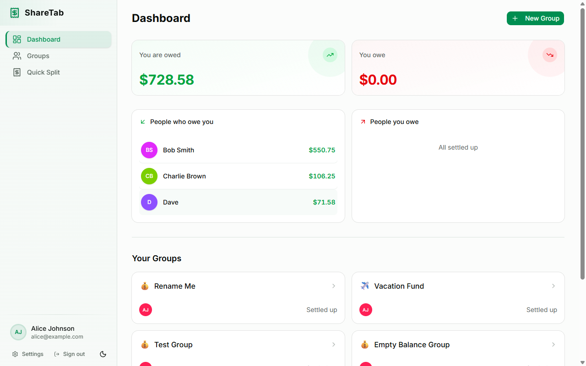
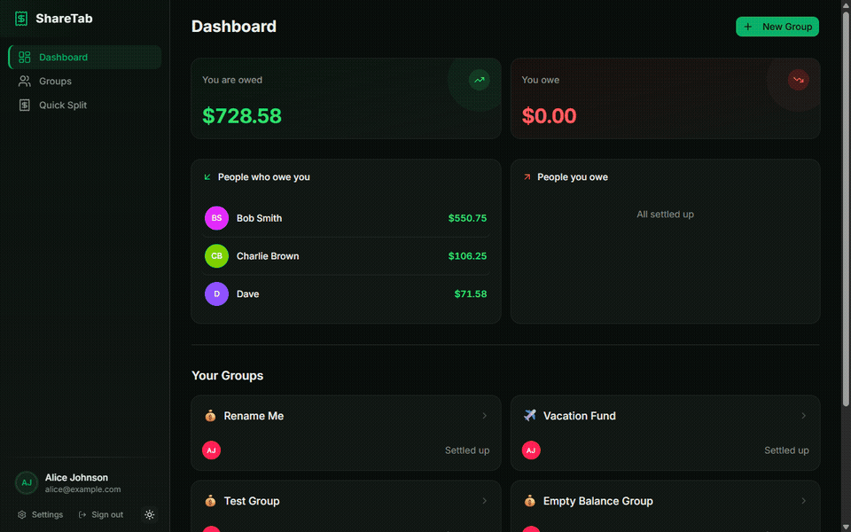
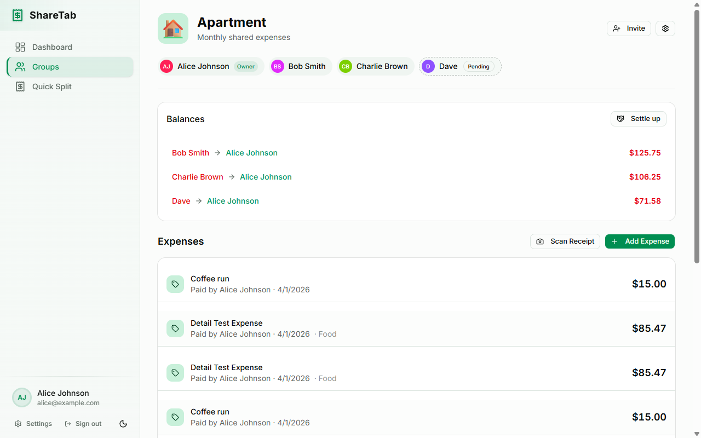
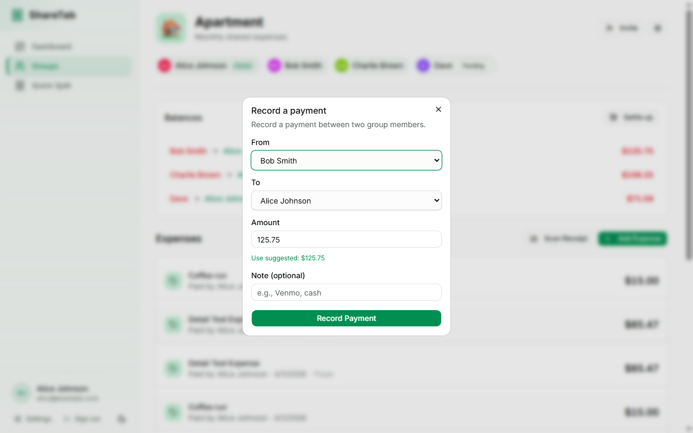
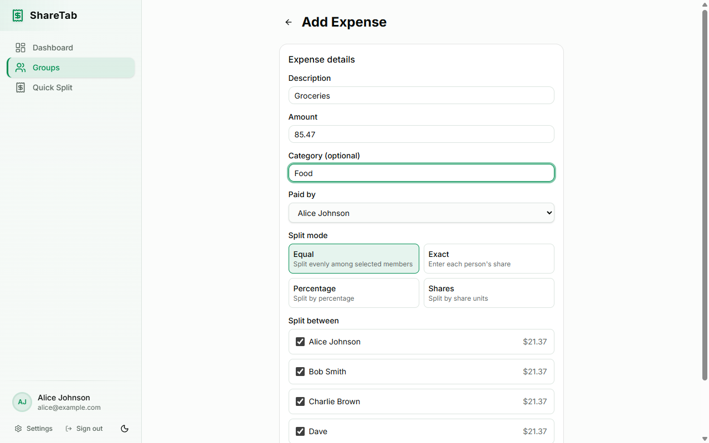
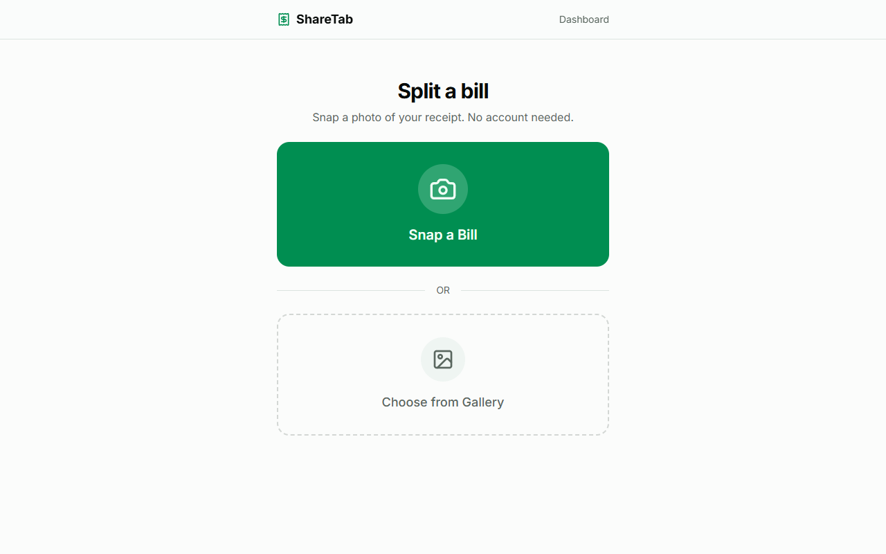
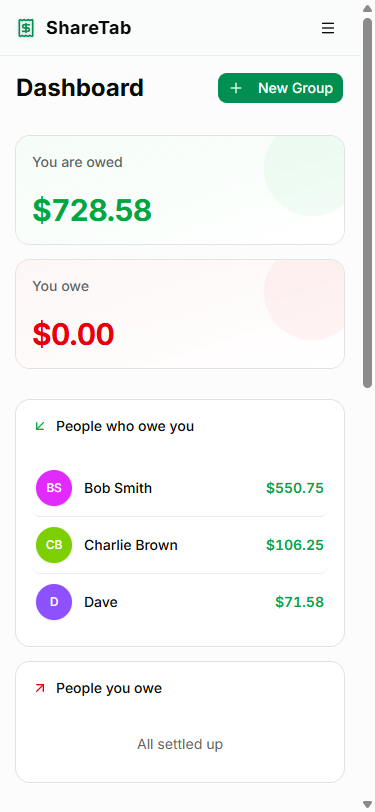
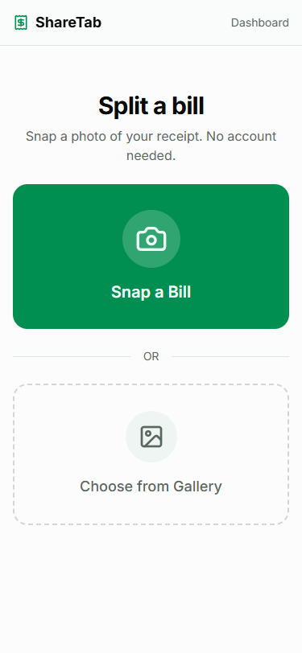

<p align="center">
  
</p>

<h1 align="center">ShareTab</h1>

<p align="center">
  A self-hosted, open-source alternative to Splitwise with AI-powered receipt scanning.
</p>

<p align="center">
  <a href="#quick-start">Quick Start</a> &bull;
  <a href="#features">Features</a> &bull;
  <a href="#screenshots">Screenshots</a> &bull;
  <a href="#configuration">Configuration</a> &bull;
  <a href="#development">Development</a>
</p>

---

ShareTab makes it easy to track shared expenses with friends, roommates, or travel groups. Snap a photo of a receipt, let AI extract the line items, and assign them to group members -- taxes and tips are split proportionally. Deploy it on your own server with a single Docker command.

## Screenshots

### Dashboard -- see all your balances at a glance

<p align="center">
  
</p>

### Dark mode -- toggle with one click

<p align="center">
  
</p>

### Group detail -- members, balances, and expenses

<p align="center">
  
</p>

### Settle up -- click a debt to pre-fill the payment dialog

<p align="center">
  
</p>

### Add expense -- 4 split modes

<p align="center">
  
</p>

### Guest bill splitting -- no account needed

<p align="center">
  
</p>

### Mobile-first design

<p align="center">
  
  &nbsp;&nbsp;
  
</p>

## Features

- **Group expense tracking** with multiple split modes (equal, percentage, shares, exact, item-level)
- **AI receipt scanning** -- photograph a receipt, AI extracts line items, assign items to group members with proportional tax/tip; zoomable/pannable receipt viewer; rescan with correction prompts
- **Guest bill splitting** -- no account needed, shareable summary links
- **Pluggable AI providers** -- OpenAI (GPT-4o), Claude (API key), Meridian (Claude Max subscription), or local Ollama
- **Group archiving** -- archive inactive groups to declutter your dashboard; toggle archived view on groups page
- **Cross-group dashboard** -- see all your balances at a glance, with per-person debt breakdown
- **Debt simplification** -- minimize the number of payments needed
- **Settle up** -- record payments between any two group members with explicit From/To fields
- **Placeholder members** -- add people without accounts; rename or remove them from group settings
- **Dark mode** -- system-aware with manual toggle
- **Invite links** -- share a link to add friends to your groups
- **Magic link auth** -- passwordless email sign-in
- **PWA** -- installable on mobile with app-like experience
- **Self-hosted** -- Docker Compose deployment, designed for Unraid

## Quick Start

ShareTab ships as an all-in-one Docker container with PostgreSQL bundled inside. No external database needed.

```bash
cd docker
cp ../.env.example .env
```

Edit `.env` with your settings -- at minimum, generate real values for `NEXTAUTH_SECRET` and `AUTH_SECRET`:

```bash
# Generate a secret
openssl rand -base64 32
```

Then start the container:

```bash
docker compose up -d
```

The app will be available at `http://localhost:3000`.

**Backups:**

```bash
docker compose exec sharetab su-exec postgres pg_dump -U sharetab sharetab > backup.sql
```

## Configuration

All configuration is done through environment variables. Copy `.env.example` to `.env` and adjust as needed.

### Required

| Variable | Description |
|---|---|
| `NEXTAUTH_SECRET` | Session encryption key. Generate with `openssl rand -base64 32`. |
| `AUTH_SECRET` | Auth.js secret. Generate the same way. |

### AI Receipt Scanning

| Variable | Description |
|---|---|
| `AI_PROVIDER` | One of `openai`, `claude`, `meridian`, or `ollama`. Defaults to `openai`. |
| `OPENAI_API_KEY` | Required when `AI_PROVIDER=openai`. |
| `ANTHROPIC_API_KEY` | Required when `AI_PROVIDER=claude`. |
| `ANTHROPIC_MODEL` | Claude model for receipt scanning. Defaults to `claude-sonnet-4-6`. |
| `OLLAMA_BASE_URL` | Ollama server URL. Defaults to `http://localhost:11434`. |
| `OLLAMA_MODEL` | Ollama model name. Defaults to `llava`. |

The `meridian` provider uses a Claude Max/Pro subscription via an embedded proxy -- no API key needed, just mount `~/.claude/.credentials.json`.

### OAuth (optional)

| Variable | Description |
|---|---|
| `GOOGLE_CLIENT_ID` | Google OAuth client ID for "Sign in with Google". |
| `GOOGLE_CLIENT_SECRET` | Corresponding client secret. |

### Magic Link Auth (optional)

| Variable | Description |
|---|---|
| `EMAIL_SERVER_HOST` | SMTP host (e.g. `smtp.gmail.com`). Required to enable magic link sign-in. |
| `EMAIL_SERVER_PORT` | SMTP port. Use `465` for implicit TLS, `587` for STARTTLS. |
| `EMAIL_SERVER_USER` | SMTP username / email address. |
| `EMAIL_SERVER_PASSWORD` | SMTP password or app password. |
| `EMAIL_FROM` | From address for sent emails. |

### Other

| Variable | Default | Description |
|---|---|---|
| `NEXTAUTH_URL` | `http://localhost:3000` | Public URL of your instance. |
| `AUTH_TRUST_HOST` | `false` | Set to `true` when running on a local network or behind a reverse proxy. |
| `DB_USER` | `sharetab` | PostgreSQL username (Docker bundled DB). |
| `DB_PASSWORD` | `sharetab` | PostgreSQL password (Docker bundled DB). |
| `DB_NAME` | `sharetab` | PostgreSQL database name (Docker bundled DB). |
| `UPLOAD_DIR` | `./uploads` | Directory for receipt image uploads. |
| `MAX_UPLOAD_SIZE_MB` | `10` | Maximum upload file size. |
| `AUTH_RATE_LIMIT_MAX` | `5` | Max login attempts per IP per hour. |
| `REGISTER_RATE_LIMIT_MAX` | `10` | Max registration attempts per IP per hour. |
| `LOG_LEVEL` | `info` | Logging verbosity: `debug`, `info`, `warn`, or `error`. |

## Tech Stack

| Layer | Technology |
|---|---|
| Framework | [Next.js 16](https://nextjs.org) (App Router) + TypeScript |
| API | [tRPC v11](https://trpc.io) (end-to-end type-safe) |
| Database | [Prisma 7](https://www.prisma.io) + PostgreSQL 16 |
| Auth | [NextAuth v5](https://authjs.dev) (credentials + OAuth + magic link) |
| UI | [TailwindCSS 4](https://tailwindcss.com) + [shadcn/ui](https://ui.shadcn.com) + [next-themes](https://github.com/pacocoursey/next-themes) |
| AI | Pluggable providers: OpenAI, Claude, Meridian, Ollama |
| Testing | [Vitest](https://vitest.dev) (unit) + [Playwright](https://playwright.dev) (e2e) |

## Development

```bash
# Install dependencies
npm install

# Generate Prisma client
npx prisma generate

# Copy and configure environment
cp .env.example .env  # Then edit .env as needed

# Option A: All-in-one (embedded PostgreSQL + schema push + seed + dev server)
npm run dev:full

# Option B: Manual setup
docker compose -f docker/docker-compose.yml up db -d  # or use your own PostgreSQL
npx prisma db push
npm run db:seed    # optional -- creates demo data
npm run dev
```

Demo accounts after seeding: `alice@example.com`, `bob@example.com`, `charlie@example.com` (password: `password123`).

### Running Tests

```bash
# Unit tests (Vitest)
npm test

# E2E tests (requires dev server running)
BASE_URL=http://localhost:3000 npx playwright test

# E2E with visible browser
BASE_URL=http://localhost:3000 npx playwright test --headed

# Include AI-dependent tests (requires configured AI provider)
BASE_URL=http://localhost:3000 RUN_AI_TESTS=1 npx playwright test
```

Set `AUTH_RATE_LIMIT_MAX=9999` in `.env` to avoid rate limiting during repeated test runs.

## Contributing

Contributions are welcome. If you find a bug or have a feature request, please [open an issue](../../issues). Pull requests are appreciated -- feel free to pick up any open issue.

## License

MIT
