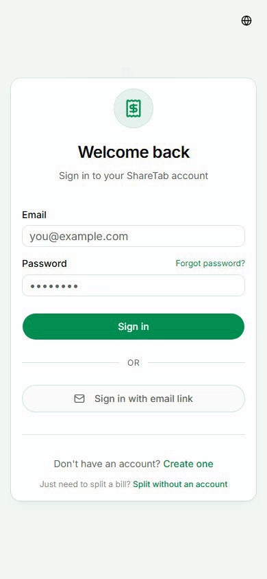
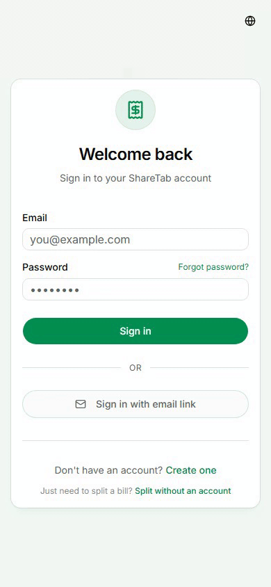
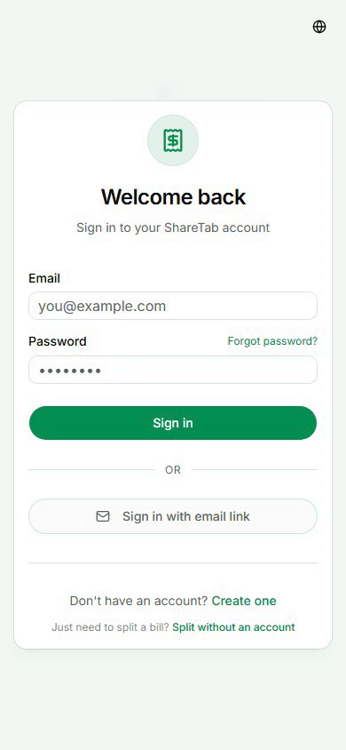
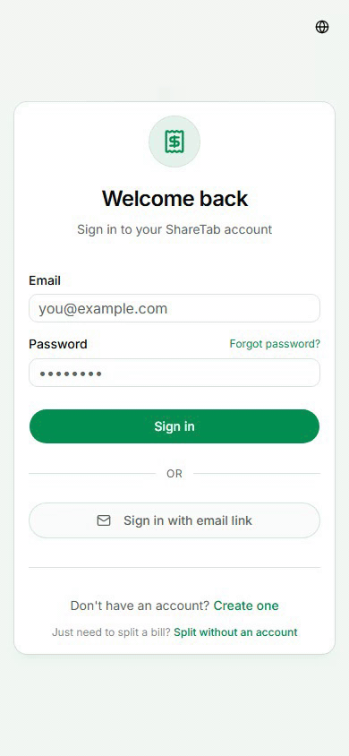
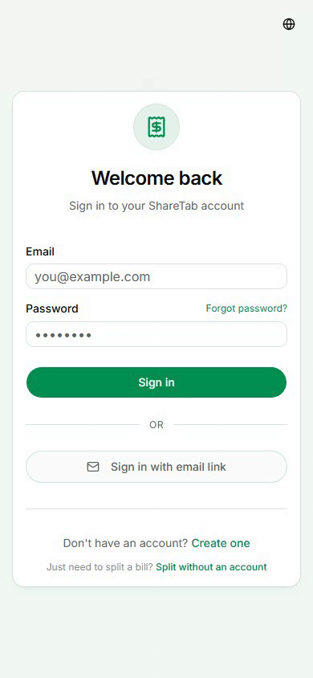
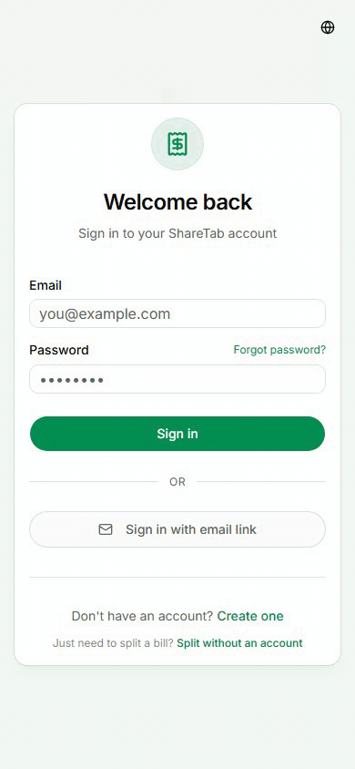
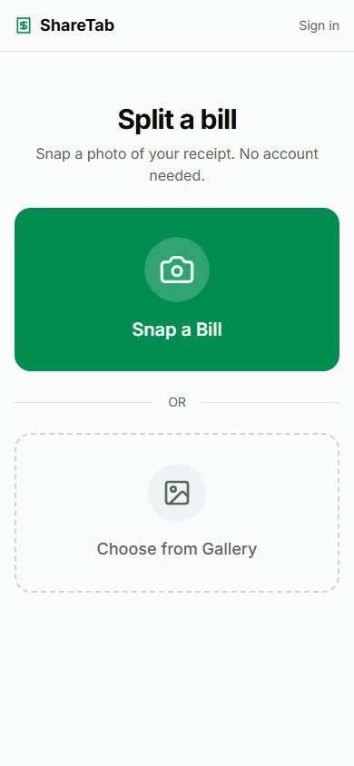
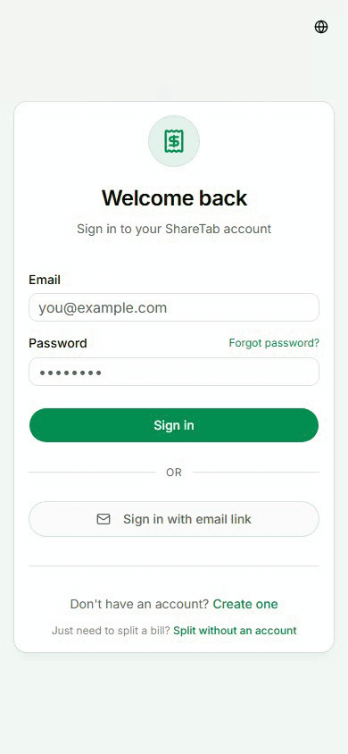
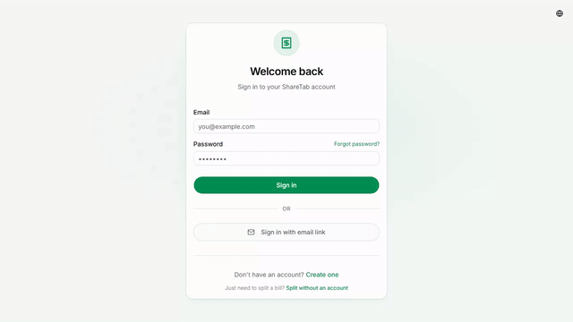

<p align="center">
  
</p>

<h1 align="center">ShareTab</h1>

<p align="center">
  A self-hosted, open-source alternative to Splitwise with AI-powered receipt scanning.
</p>

<p align="center">
  <a href="#quick-start">Quick Start</a> &bull;
  <a href="#features">Features</a> &bull;
  <a href="#screenshots">Screenshots</a> &bull;
  <a href="#configuration">Configuration</a> &bull;
  <a href="#development">Development</a>
</p>

<p align="center">
  <a href="LICENSE"></a>
  
  
</p>

---

ShareTab is a free, self-hosted alternative to Splitwise for tracking shared expenses with roommates, friends, and travel groups. Snap a photo of a receipt, let AI extract the line items, and assign them to group members. Taxes and tips split proportionally. Deploy on your own server with Docker Compose.

## Screenshots

### Dashboard -- see all your balances at a glance

<p align="center">
  
</p>

### AI receipt scanning -- snap a photo, assign items to people

<p align="center">
  
</p>

### Split modes -- equal, exact, percentage, or shares

<p align="center">
  
</p>

### Add expense -- quick and simple

<p align="center">
  
</p>

### Create a group -- emoji, currency, and description

<p align="center">
  
</p>

### Settle up -- click a debt to record payment

<p align="center">
  
</p>

### Invite members -- share a link

<p align="center">
  
</p>

### Guest bill splitting -- no account needed

<p align="center">
  
</p>

### Group settings

<p align="center">
  
</p>

### Dark mode -- toggle with one click

<p align="center">
  
</p>

### Admin dashboard -- manage users, AI providers, and system settings

<p align="center">
  
</p>

## Features

- **Group expense tracking** with multiple split modes (equal, percentage, shares, exact, item-level)
- **AI receipt scanning** -- photograph a receipt, AI extracts line items, assign items to group members with proportional tax/tip; zoomable/pannable receipt viewer; rescan with correction prompts
- **Guest bill splitting** -- no account needed, shareable summary links
- **Pluggable AI providers** -- OpenAI (GPT-4o), OpenAI-Codex (ChatGPT OAuth), Claude (API key), Meridian (Claude Max subscription), local Ollama, or OCR fallback (no API key needed)
- **Group archiving** -- archive inactive groups to declutter your dashboard; toggle archived view on groups page
- **Cross-group dashboard** -- see all your balances at a glance, with per-person debt breakdown
- **Debt simplification** -- minimize the number of payments needed
- **Settle up** -- record payments between any two group members with explicit From/To fields
- **Placeholder members** -- add people without accounts; rename or remove them from group settings
- **Dark mode** -- system-aware with manual toggle
- **Invite links** -- share a link to add friends to your groups
- **Magic link auth** -- passwordless email sign-in
- **PWA** -- installable on mobile with app-like experience
- **Admin dashboard** -- user management, group overview, storage stats, AI usage, audit log, registration control, announcements, server logs, user impersonation, data export, expired guest split cleanup
- **Self-hosted** -- Docker Compose deployment, designed for Unraid

## Quick Start

ShareTab ships as an all-in-one Docker container with PostgreSQL bundled inside. No external database needed.

```bash
cd docker
cp ../.env.example .env
```

Edit `.env` with your settings -- at minimum, generate real values for `NEXTAUTH_SECRET` and `AUTH_SECRET`:

```bash
# Generate a secret
openssl rand -base64 32
```

Then start the container:

```bash
docker compose up -d
```

The app will be available at `http://localhost:3000`.

## Unraid

If you want to run ShareTab on Unraid, this repo includes a ready-made template at [unraid/sharetab.xml](unraid/sharetab.xml).

To use it:

```bash
# On your Unraid server
mkdir -p /boot/config/plugins/dockerMan/templates-user
cp /path/to/sharetab/unraid/sharetab.xml /boot/config/plugins/dockerMan/templates-user/sharetab.xml
```

Then in the Unraid web UI:

1. Open `Docker`.
2. Click `Add Container`.
3. Select the `ShareTab` template from the template dropdown.
4. Fill in the required variables like `AUTH_SECRET`, `NEXTAUTH_SECRET`, and any optional AI settings.
5. Click `Apply` to create and start the container.

You can also skip the manual copy and paste the raw template URL into Unraid's template install flow:

`https://raw.githubusercontent.com/sw-carlos-cristobal/sharetab/main/unraid/sharetab.xml`

**Backups:**

```bash
docker compose exec sharetab su-exec postgres pg_dump -U sharetab sharetab > backup.sql
```

## Configuration

All configuration is done through environment variables. Copy `.env.example` to `.env` and adjust as needed.

### Required

| Variable | Description |
|---|---|
| `NEXTAUTH_SECRET` | Session encryption key. Generate with `openssl rand -base64 32`. |
| `AUTH_SECRET` | Auth.js secret. Generate the same way. |

### AI Receipt Scanning

| Variable | Description |
|---|---|
| `AI_PROVIDER_PRIORITY` | Comma-separated provider priority list (for example `openai-codex,meridian,openai,ocr`). ShareTab checks providers in order, uses the first available one, and falls through to the next provider if extraction fails. If `ocr` is omitted, ShareTab appends OCR as the final fallback. |
| `OPENAI_API_KEY` | Required when `openai` is included in `AI_PROVIDER_PRIORITY`. |
| `OPENAI_MODEL` | OpenAI model for receipt scanning. Defaults to `gpt-4o`. |
| `OPENAI_CODEX_MODEL` | Model for ChatGPT OAuth / Codex backend receipt scanning. Defaults to `gpt-5.4`. |
| `ANTHROPIC_API_KEY` | Required when `claude` is included in `AI_PROVIDER_PRIORITY`. |
| `ANTHROPIC_MODEL` | Claude model for receipt scanning. Defaults to `claude-sonnet-4-6` (claude provider) or `claude-opus-4-6` (meridian provider). |
| `ANTHROPIC_HEALTH_MODEL` | Model for health-check probes (auth verification). Defaults to `claude-haiku-4-5-20251001`. |
| `MERIDIAN_PORT` | Port for the embedded Meridian proxy. Defaults to `3457`. |
| `OLLAMA_BASE_URL` | Ollama server URL. Defaults to `http://localhost:11434`. |
| `OLLAMA_MODEL` | Ollama model name. Defaults to `llava`. |

The `openai-codex` provider uses ChatGPT OAuth via the Codex backend instead of an API key. Auth data lives in `/app/chatgpt`, so if that path is on a persistent volume the login survives restarts and image updates.

After the container is running, open the ShareTab admin dashboard and complete the ChatGPT OAuth flow there:

1. Sign in as the admin user and open `/admin`.
2. In the ChatGPT OAuth section, start the login flow.
3. Authorize with ChatGPT in your browser.
4. When the flow redirects to `http://localhost:1455/auth/callback`, copy the full URL from the browser address bar and paste it back into ShareTab.

If you use your own Docker or Unraid template, mount a persistent path to `/app/chatgpt` when `openai-codex` is in `AI_PROVIDER_PRIORITY`.

The `meridian` provider uses a Claude Max/Pro subscription via an embedded proxy -- no API key needed. Claude login data lives in `/app/claude`, so if that path is on a persistent volume the login survives restarts and image updates.

After the container is running, open the ShareTab admin dashboard and complete the Meridian login flow there:

1. Sign in as the admin user and open `/admin`.
2. In the Meridian auth section, start the login flow.
3. Authorize with Claude in your browser.
4. Copy the full callback URL from the browser address bar and paste it back into ShareTab.

The bundled Docker Compose setup persists `/app/claude` automatically. If you use your own Docker or Unraid template, mount a persistent path to `/app/claude`.

The `ocr` provider uses Tesseract.js for local text extraction -- no API key or external service needed. It's less accurate than AI providers but works as a free fallback. In priority mode, OCR can be listed explicitly, and is also appended automatically as a final fallback if omitted.

### AI Provider Performance

Benchmarked on a set of receipt photos (grocery, coffee shop, restaurant). Results represent typical single-receipt extraction.

| Provider | Speed | Item Accuracy | Cost | Notes |
|---|---|---|---|---|
| **OpenAI Codex** (ChatGPT OAuth) | ~6 s | 5/5 items | Free (uses ChatGPT subscription) | **Recommended.** Best balance of speed and accuracy. |
| **Meridian** (Claude OAuth) | ~16 s | 5/5 items | Free (uses Claude Max subscription) | Same accuracy, but 2–3x slower. |
| **OpenAI** (API key) | ~4 s | 5/5 items | Pay-per-token | Fastest, but requires an API key and costs money. |
| **OCR** (Tesseract.js) | ~1.4 s | 5/5 items | Free, fully local | No network calls. Good for simple receipts; struggles with handwritten or low-contrast text. |
| **Ollama** (local LLM) | Varies | Varies | Free, fully local | Depends on model and hardware. Requires a running Ollama server. |

**Recommendation:** Use `openai-codex` as your primary provider. It delivers the same accuracy as API-key providers at no additional cost (it piggybacks on your existing ChatGPT Plus/Pro subscription). Set your priority to:

```
AI_PROVIDER_PRIORITY="openai-codex,ocr"
```

If you also have a Claude Max subscription, you can add `meridian` as a second fallback:

```
AI_PROVIDER_PRIORITY="openai-codex,meridian,ocr"
```

OCR is always appended as the final fallback if omitted, so even if your OAuth session expires, receipt scanning will still work.

### OAuth (optional)

| Variable | Description |
|---|---|
| `GOOGLE_CLIENT_ID` | Google OAuth client ID for "Sign in with Google". |
| `GOOGLE_CLIENT_SECRET` | Corresponding client secret. |

### Magic Link Auth (optional)

| Variable | Description |
|---|---|
| `EMAIL_SERVER_HOST` | SMTP host (e.g. `smtp.gmail.com`). Used for magic link sign-in and OAuth auth expiry alerts (Meridian / ChatGPT OAuth). |
| `EMAIL_SERVER_PORT` | SMTP port. Use `465` for implicit TLS, `587` for STARTTLS. |
| `EMAIL_SERVER_USER` | SMTP username / email address. |
| `EMAIL_SERVER_PASSWORD` | SMTP password or app password. |
| `EMAIL_FROM` | From address for sent emails. |

### Admin

| Variable | Description |
|---|---|
| `ADMIN_EMAIL` | Email of the admin user. Grants access to `/admin` dashboard for managing users, groups, storage, and system settings, and receives OAuth auth expiry alerts when email is configured. |

### Other

| Variable | Default | Description |
|---|---|---|
| `NEXTAUTH_URL` | `http://localhost:3000` | Public URL of your instance. |
| `AUTH_TRUST_HOST` | `false` | Set to `true` when running on a local network or behind a reverse proxy. |
| `DB_USER` | `sharetab` | PostgreSQL username (Docker bundled DB). |
| `DB_PASSWORD` | `sharetab` | PostgreSQL password (Docker bundled DB). |
| `DB_NAME` | `sharetab` | PostgreSQL database name (Docker bundled DB). |
| `UPLOAD_DIR` | `./uploads` | Directory for receipt image uploads. |
| `MAX_UPLOAD_SIZE_MB` | `10` | Maximum upload file size. |
| `AUTH_RATE_LIMIT_MAX` | `5` | Max login attempts per IP per hour. |
| `REGISTER_RATE_LIMIT_MAX` | `10` | Max registration attempts per IP per hour. |
| `GUEST_RATE_LIMIT_MAX` | `10` | Max guest split creations per IP per hour. |
| `LOG_LEVEL` | `info` | Logging verbosity: `debug`, `info`, `warn`, or `error`. |

## Tech Stack

| Layer | Technology |
|---|---|
| Framework | [Next.js 16](https://nextjs.org) (App Router) + TypeScript |
| API | [tRPC v11](https://trpc.io) (end-to-end type-safe) |
| Database | [Prisma 7](https://www.prisma.io) + PostgreSQL 16 |
| Auth | [NextAuth v5](https://authjs.dev) (credentials + OAuth + magic link) |
| UI | [TailwindCSS 4](https://tailwindcss.com) + [shadcn/ui](https://ui.shadcn.com) + [next-themes](https://github.com/pacocoursey/next-themes) |
| AI | Pluggable providers: OpenAI, OpenAI-Codex, Claude, Meridian, Ollama, OCR fallback |
| Testing | [Vitest](https://vitest.dev) (unit) + [Playwright](https://playwright.dev) (e2e) |

## Development

### Automation Commands

These commands are intended to be explicit enough for a human or an LLM to use without inferring repo-specific workflow details.

```bash
# Bump version files on main and update CHANGELOG.md
npm run version:bump -- patch

# Create a release branch + PR from main
npm run release:create -- patch

# Create a PR from the current branch
npm run pr:create -- --title "feat: example change"

# Push the current HEAD to origin/main
npm run push:main

# Publish a merged release by pushing the version tag
npm run release:publish -- v1.2.3
```

Intent mapping:

- "bump the version" -> `npm run version:bump -- <patch|minor|major>`
- "create a release" -> `npm run release:create -- <patch|minor|major>`
- "create a PR" -> `npm run pr:create -- [--base main] [--title \"...\"]`
- "push to main" -> `npm run push:main`
- "publish the release" -> `npm run release:publish -- [vX.Y.Z]`

Release flow:

1. Run `npm run release:create -- patch` from `main`.
2. Merge the generated `release/vX.Y.Z` PR.
3. Run `npm run release:publish -- vX.Y.Z` from `main`.

`release:publish` only creates and pushes the git tag. The actual GitHub release page and semver Docker images are still published by [publish-release.yml](./.github/workflows/publish-release.yml).

```bash
# Install dependencies
npm install

# Generate Prisma client
npx prisma generate

# Copy and configure environment
cp .env.example .env  # Then edit .env as needed

# Option A: All-in-one (embedded PostgreSQL + schema push + seed + dev server)
npm run dev:full

# Option B: Manual setup (bring your own PostgreSQL)
# Set DATABASE_URL in .env pointing to your PostgreSQL instance
npx prisma db push
npm run db:seed    # optional -- creates demo data
npm run dev
```

Demo accounts after seeding: `alice@example.com`, `bob@example.com`, `charlie@example.com` (password: `password123`).

### Running Tests

```bash
# Unit tests (Vitest)
npm test

# E2E tests (requires dev server running)
BASE_URL=http://localhost:3000 npx playwright test

# E2E with visible browser
BASE_URL=http://localhost:3000 npx playwright test --headed

# Include AI-dependent tests (requires configured AI provider)
BASE_URL=http://localhost:3000 RUN_AI_TESTS=1 npx playwright test
```

Set `AUTH_RATE_LIMIT_MAX=9999` and `GUEST_RATE_LIMIT_MAX=9999` in `.env` to avoid rate limiting during repeated test runs.

## Contributing

Contributions are welcome! See [CONTRIBUTING.md](CONTRIBUTING.md) for development setup, PR guidelines, and code style.

If you find a bug or have a feature request, please [open an issue](../../issues).

## Security

To report a vulnerability, see [SECURITY.md](SECURITY.md).

## License

MIT
