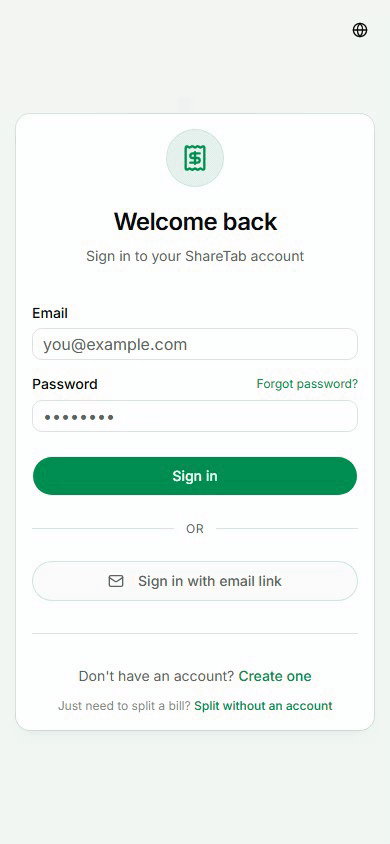
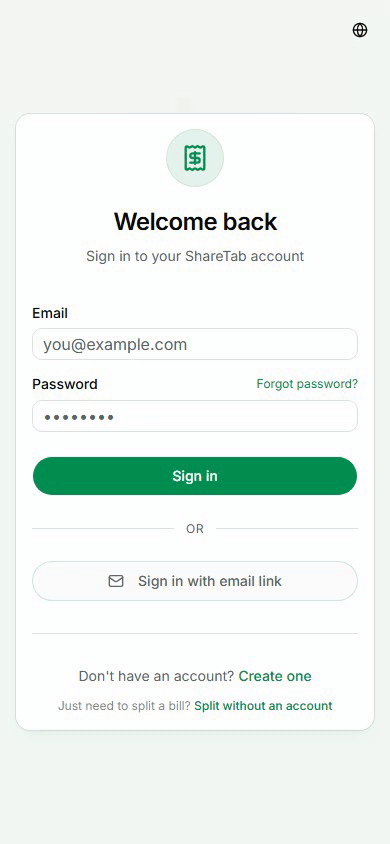
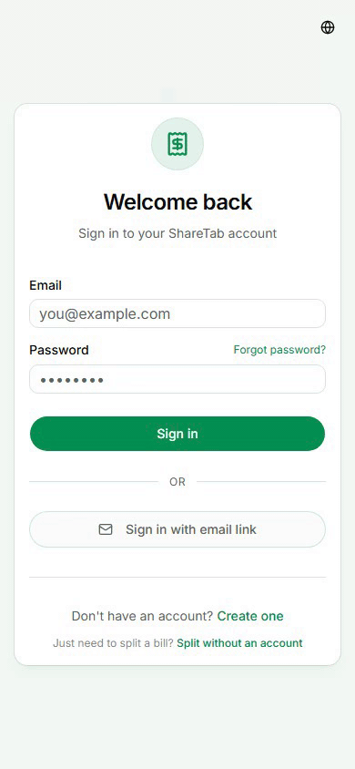
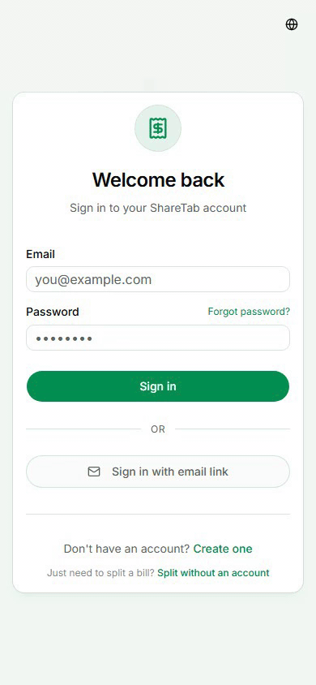
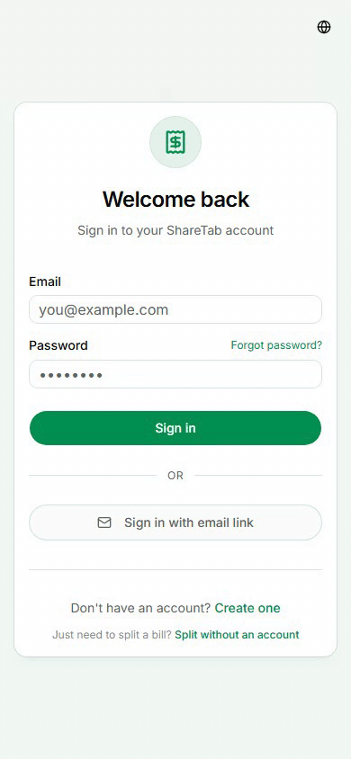
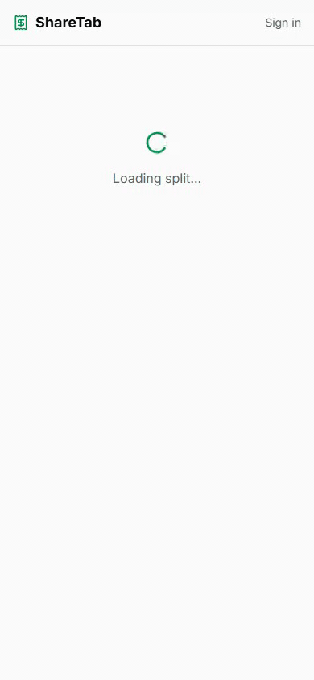
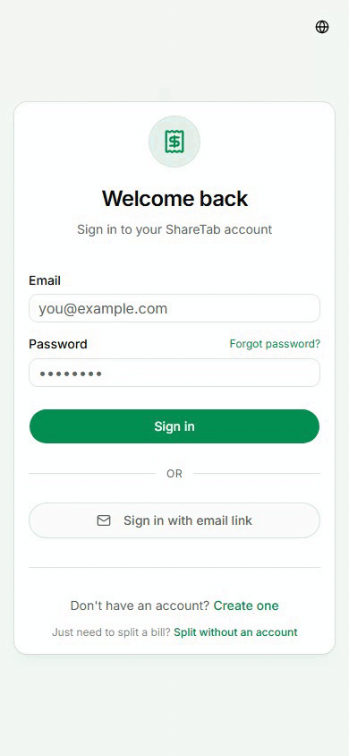
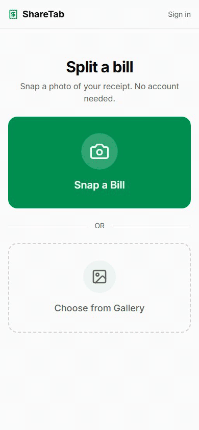
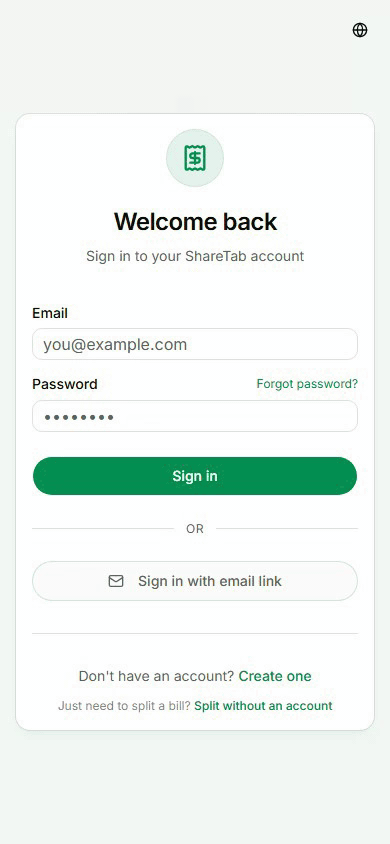
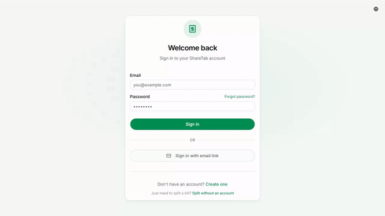

<p align="center">
  
</p>

<h1 align="center">ShareTab</h1>

<p align="center">
  A self-hosted, open-source alternative to Splitwise with AI-powered receipt scanning.
</p>

<p align="center">
  <a href="#quick-start">Quick Start</a> &bull;
  <a href="#features">Features</a> &bull;
  <a href="#screenshots">Screenshots</a> &bull;
  <a href="#configuration">Configuration</a> &bull;
  <a href="#development">Development</a>
</p>

<p align="center">
  <a href="LICENSE"></a>
  
  
</p>

---

ShareTab is a free, self-hosted alternative to Splitwise for tracking shared expenses with roommates, friends, and travel groups. Snap a photo of a receipt, let AI extract the line items, and assign them to group members. Taxes and tips split proportionally. Deploy on your own server with Docker Compose.

## Screenshots

### Dashboard -- see all your balances at a glance

<p align="center">
  
</p>

### AI receipt scanning -- snap a photo, assign items to people

<p align="center">
  
</p>

### Split modes -- equal, exact, percentage, or shares

<p align="center">
  
</p>

### Add expense -- quick and simple

<p align="center">
  
</p>

### Multi-currency -- spend in any currency, settle in the group's currency

<p align="center">
  
</p>

### Create a group -- emoji, currency, and description

<p align="center">
  
</p>

### Settle up -- click a debt to record payment

<p align="center">
  
</p>

### Venmo payments -- one tap to pay your share

<p align="center">
  
</p>

### Invite members -- share a link

<p align="center">
  
</p>

### Guest bill splitting -- no account needed

<p align="center">
  
</p>

### Group settings

<p align="center">
  
</p>

### Dark mode -- toggle with one click

<p align="center">
  
</p>

### 9 languages -- switch the entire UI in one click

<p align="center">
  
</p>

### Admin dashboard -- manage users, AI providers, and system settings

<p align="center">
  
</p>

## Features

- **Group expense tracking** with multiple split modes (equal, percentage, shares, exact, item-level)
- **AI receipt scanning** -- photograph a receipt, AI extracts line items, assign items to group members with proportional tax/tip; zoomable/pannable receipt viewer; rescan with correction prompts
- **Multi-currency** -- record an expense in any currency and ShareTab converts it to the group's currency at the exchange rate for the expense date (ECB rates from [frankfurter.app](https://frankfurter.app), no API key; the server needs outbound internet access). For a currency without an ECB rate, or when the lookup fails, enter the rate yourself (expenses created from a scanned receipt can't take a manual rate)
- **Claim sessions** -- share a scanned receipt as a link so everyone picks their own items: split an item between people, join as a couple or group that pays a proportional share, and finalize when done; works for guest splits and group receipt scans, and signed-in users find their guest splits under **My Splits**
- **Venmo payments** -- one-tap Venmo pay links on guest split results, claim sessions, and group balances; paying a group debt records the settlement after you confirm. USD only, and off by default: an admin enables it, users add their Venmo handle in Settings, and a guest split's creator (signed in) adds theirs on the split
- **9 languages** -- English, Spanish, Swedish, French, German, Brazilian Portuguese, Japanese, Simplified Chinese, and Korean, with locale-aware money formatting; each user's choice is saved to their account
- **Guest bill splitting** -- no account needed, shareable summary links; admins can turn off guest receipt uploads (admin toggle or `DISABLE_GUEST_UPLOADS`) so anonymous visitors can't upload receipt images or run AI scans (signed-in users with an active account keep access, so also limit who can create an account: Registration Control only covers password sign-up, while magic link, Google and OIDC auto-registration still create accounts; see [Security notes](#oidc-security-notes))
- **Pluggable AI providers** -- OpenAI (GPT-4o), OpenAI-Codex (ChatGPT OAuth), Claude (API key), Meridian (Claude Max subscription), local Ollama
- **Group archiving** -- archive inactive groups to declutter your dashboard; toggle archived view on groups page
- **Cross-group dashboard** -- see all your balances at a glance, with per-person debt breakdown
- **Debt simplification** -- minimize the number of payments needed
- **Settle up** -- record payments between any two group members with explicit From/To fields
- **Placeholder members** -- add people without accounts; rename or remove them from group settings
- **Dark mode** -- system-aware with manual toggle
- **Invite links** -- share a link to add friends to your groups
- **Magic link auth** -- passwordless email sign-in
- **Single sign-on (OIDC)** -- sign in with Authentik, Authelia, Keycloak, or other OpenID Connect providers; optional auto-registration and password-login disable
- **PWA** -- installable on mobile with app-like experience
- **Admin dashboard** -- system health (database, version and commit, uptime), user management, group overview, storage stats, AI usage, AI provider test, Meridian and ChatGPT OAuth login, auth-expiry email alerts, activity feed, audit log, registration control, guest receipt upload toggle, Venmo toggle, announcements, server logs, user impersonation, data export, expired guest split cleanup
- **Self-hosted** -- Docker Compose deployment, designed for Unraid

## Quick Start

ShareTab ships as an all-in-one Docker container with PostgreSQL bundled inside. No external database needed. The bundled Compose file builds the image from your checkout of this repo:

```bash
git clone https://github.com/sw-carlos-cristobal/sharetab.git
cd sharetab/docker
cp ../.env.example .env
```

Edit `.env` with your settings -- at minimum, generate real values for `NEXTAUTH_SECRET` and `AUTH_SECRET`:

```bash
# Generate a secret
openssl rand -base64 32
```

Then build and start the container:

```bash
docker compose up -d --build
```

The app will be available at `http://localhost:3000`.

## Unraid

If you want to run ShareTab on Unraid, this repo includes a ready-made template at [unraid/sharetab.xml](unraid/sharetab.xml).

To use it:

```bash
# On your Unraid server
mkdir -p /boot/config/plugins/dockerMan/templates-user
cp /path/to/sharetab/unraid/sharetab.xml /boot/config/plugins/dockerMan/templates-user/sharetab.xml
```

Then in the Unraid web UI:

1. Open `Docker`.
2. Click `Add Container`.
3. Select the `ShareTab` template from the template dropdown.
4. Fill in the required variables like `AUTH_SECRET`, `NEXTAUTH_SECRET`, and any optional AI settings.
5. Click `Apply` to create and start the container.

You can also skip the manual copy and paste the raw template URL into Unraid's template install flow:

`https://raw.githubusercontent.com/sw-carlos-cristobal/sharetab/main/unraid/sharetab.xml`

The template runs the prebuilt `ghcr.io/sw-carlos-cristobal/sharetab:stable` image (see [Prebuilt images](#prebuilt-images)). To upgrade, click **Check for Updates** in the Docker tab, then apply the update.

<a id="backups"></a>**Backups:**

```bash
# Unraid (the template names the container "sharetab")
docker exec sharetab su-exec postgres pg_dump -U sharetab sharetab > backup.sql

# Docker Compose (run from the docker/ directory)
docker compose exec sharetab su-exec postgres pg_dump -U sharetab sharetab > backup.sql
```

The dump covers the database only. A full backup also needs the receipt images (`/app/uploads`), the AI provider logins if you use `meridian` or `openai-codex` (`/app/claude`, `/app/chatgpt`), and your settings. On Unraid the data folders are under `/mnt/user/appdata/sharetab/` and the template settings are on the flash drive (`/boot/config/plugins/dockerMan/templates-user/`); with Compose the data is in the `docker_uploads`, `docker_claude`, and `docker_chatgpt` named volumes (Compose prefixes volume names with the project name, `docker` by default; `docker volume ls` lists them) and the settings are in `docker/.env`.

Files can change between the dump and the copy while people use ShareTab. For a backup where everything matches, stop the container and copy all of its data while it is stopped: on Unraid the whole `/mnt/user/appdata/sharetab/` folder (it includes the database files in `db/`), with Compose the `docker_pgdata`, `docker_uploads`, `docker_claude`, and `docker_chatgpt` volumes. Keep file ownership when you copy (`cp -a` or `rsync -a`), or PostgreSQL can't read its files after a restore.

## Upgrading

Before upgrading:

1. Take a full backup (see [Backups](#backups)).
2. Read the sections below: any upgrade that needs a manual step is described there. The [build releases](../../releases) list every commit since the build you run.
3. Compare `.env.example` with your `.env` (or the Unraid template) for new variables.

Going back to an older build isn't supported once a newer one has changed the database schema: on start, `prisma db push` can refuse to drop the newer columns, and the container won't start. Restore the backup you took before upgrading instead.

The bundled Compose file builds the image from your checkout, so upgrade by updating the checkout and rebuilding. From the `docker/` directory:

```bash
git pull
docker compose up -d --build
```

`docker compose pull` alone doesn't upgrade this setup: the image is built locally, not pulled.

### Prebuilt images

Each push to `main` starts an image build, and each build that finishes is published to the GitHub Container Registry. To run a prebuilt image instead of building one, replace the `build:` block and `image: sharetab:latest` in `docker/docker-compose.yml` with one of these tags, then upgrade from the `docker/` directory with `docker compose pull && docker compose up -d`:

| Tag                                           | What it is                                                                                                                                                                      |
| --------------------------------------------- | ------------------------------------------------------------------------------------------------------------------------------------------------------------------------------- |
| `ghcr.io/sw-carlos-cristobal/sharetab:stable` | A build the maintainer has promoted as stable. Recommended; the Unraid template uses this tag. It can lag `main`, so a feature described in this README may not be in it yet.   |
| `ghcr.io/sw-carlos-cristobal/sharetab:latest` | The newest commit on `main`, whether or not it has been promoted, so it can include changes that haven't been tried outside CI.                                                 |
| `ghcr.io/sw-carlos-cristobal/sharetab:<sha>`  | One specific commit (short SHA, e.g. `870a80e`), for pinning. A push that lands while the previous build is still running cancels that build, so not every commit has an image. |

Each push to `main` also gets a GitHub release named `Build YYYY.MM.DD.N-<sha>` listing the changes since the previous build; see [Releases](../../releases). The `stable` git tag normally marks the commit `:stable` was built from ([browse it](../../tree/stable)); after a failed promotion (see [Releases](#releases)) the tag and the image can point at different commits. ShareTab no longer publishes numbered (semver) versions; the last was v0.8.0.

### Removed OCR provider

The `ocr` receipt provider was removed in build `2026.05.16.1` (#143). Before that, ShareTab fell back to OCR automatically whenever no other provider worked, and the default was `openai,ocr`. If none of your other providers works (for example the default `openai` with no `OPENAI_API_KEY`, or `meridian` that was never logged in), receipt scanning stops working after the upgrade. Configure a working provider first (see [AI Receipt Scanning](#ai-receipt-scanning)).

### Database changes on upgrade

The entrypoint automatically runs any SQL migration files in `prisma/migrations/` before applying the Prisma schema, and the files in `prisma/after-push/` after it. Most upgrades are fully automatic.

### Manual migration: GuestSplit status enum (builds after v0.8.0)

Builds after v0.8.0 (#127) added an `updatedAt` column and converted the `status` column from text to an enum on the `GuestSplit` table. This migration now runs automatically on container startup. If you need to run it manually:

```bash
# Unraid
docker exec sharetab su-exec postgres psql -U sharetab -d sharetab \
  -f /app/prisma/migrations/guest_split_status_enum.sql

# Docker Compose (run from the docker/ directory)
docker compose exec sharetab su-exec postgres psql -U sharetab -d sharetab \
  -f /app/prisma/migrations/guest_split_status_enum.sql
```

This is idempotent — safe to run more than once.

<a id="email-case-uniqueness"></a>

### Accounts whose emails differ only in letter case

The database rejects a new account whose email matches an existing one ignoring case (`Alice@example.com` and `alice@example.com`). The index that enforces this is created on startup, but it can't be created while such accounts already exist, which older versions allowed. In that case ShareTab starts normally and the container log shows a warning listing the affected addresses:

```
WARNING:  Case-insensitive email uniqueness is not enforced yet: more than one account uses each of these addresses in different letter cases: alice@example.com. ...
```

In the admin dashboard, delete the account the person no longer uses (its expenses stay in their groups under "Deleted user"). The index is created on the next start, or right away with:

```bash
# Unraid
docker exec sharetab su-exec postgres psql -U sharetab -d sharetab \
  -f /app/prisma/after-push/user_email_lower_unique.sql

# Docker Compose (run from the docker/ directory)
docker compose exec sharetab su-exec postgres psql -U sharetab -d sharetab \
  -f /app/prisma/after-push/user_email_lower_unique.sql
```

## Configuration

All configuration is done through environment variables. Copy `.env.example` to `.env` and adjust as needed.

### Required

| Variable          | Description                                                      |
| ----------------- | ---------------------------------------------------------------- |
| `NEXTAUTH_SECRET` | Session encryption key. Generate with `openssl rand -base64 32`. |
| `AUTH_SECRET`     | Auth.js secret. Generate the same way.                           |

### AI Receipt Scanning

| Variable                 | Description                                                                                                                                                                                                        |
| ------------------------ | ------------------------------------------------------------------------------------------------------------------------------------------------------------------------------------------------------------------ |
| `AI_PROVIDER_PRIORITY`   | Comma-separated provider priority list (for example `openai-codex,meridian,openai`). ShareTab checks providers in order, uses the first available one, and falls through to the next provider if extraction fails. |
| `OPENAI_API_KEY`         | Required when `openai` is included in `AI_PROVIDER_PRIORITY`.                                                                                                                                                      |
| `OPENAI_MODEL`           | OpenAI model for receipt scanning. Defaults to `gpt-4o`.                                                                                                                                                           |
| `OPENAI_CODEX_MODEL`     | Model for ChatGPT OAuth / Codex backend receipt scanning. Defaults to `gpt-5.5`.                                                                                                                                   |
| `ANTHROPIC_API_KEY`      | Required when `claude` is included in `AI_PROVIDER_PRIORITY`.                                                                                                                                                      |
| `ANTHROPIC_MODEL`        | Claude model for receipt scanning (claude and meridian providers). Defaults to `claude-sonnet-5`.                                                                                                                  |
| `ANTHROPIC_HEALTH_MODEL` | Model for health-check probes (auth verification). Defaults to `claude-haiku-4-5-20251001`.                                                                                                                        |
| `MERIDIAN_PORT`          | Port for the embedded Meridian proxy. Defaults to `3457`.                                                                                                                                                          |
| `OLLAMA_BASE_URL`        | Ollama server URL. Defaults to `http://localhost:11434`.                                                                                                                                                           |
| `OLLAMA_MODEL`           | Ollama model name. Defaults to `llava`.                                                                                                                                                                            |

The defaults above are what ShareTab uses when a variable is unset. The Unraid template sets `ANTHROPIC_MODEL=claude-opus-4-6`, so there the `claude` provider also uses Opus unless you change it, and its `OLLAMA_BASE_URL` is a placeholder (`http://192.168.1.x:11434`) to replace with your Ollama host. With Docker Compose, the values in `docker/.env` win for the variables `docker-compose.yml` passes to the container (a variable exported in your shell wins over `.env`; others in `.env`, such as `DATABASE_URL`, are ignored); the fallbacks in `docker-compose.yml` apply only to variables left unset or empty. `UPLOAD_DIR` is the exception: the Compose file fixes it at `/app/uploads`.

**Using `ollama` in Docker:** `localhost` inside the container is the container itself, so set `OLLAMA_BASE_URL` to the address of the machine running Ollama.

The `openai-codex` provider uses ChatGPT OAuth via the Codex backend instead of an API key. Auth data lives in `/app/chatgpt`, so if that path is on a persistent volume the login survives restarts and image updates.

After the container is running, open the ShareTab admin dashboard and complete the ChatGPT OAuth flow there:

1. Sign in as the admin user and open `/admin`.
2. In the ChatGPT OAuth section, start the login flow.
3. Authorize with ChatGPT in your browser.
4. When the flow redirects to `http://localhost:1455/auth/callback`, copy the full URL from the browser address bar and paste it back into ShareTab.

If you use your own Docker or Unraid template, mount a persistent path to `/app/chatgpt` when `openai-codex` is in `AI_PROVIDER_PRIORITY`.

The `meridian` provider uses a Claude Max/Pro subscription via an embedded proxy -- no API key needed. Claude login data lives in `/app/claude`, so if that path is on a persistent volume the login survives restarts and image updates.

After the container is running, open the ShareTab admin dashboard and complete the Meridian login flow there:

1. Sign in as the admin user and open `/admin`.
2. In the Meridian auth section, start the login flow.
3. Authorize with Claude in your browser.
4. Copy the full callback URL from the browser address bar and paste it back into ShareTab.

The bundled Docker Compose setup persists `/app/claude` automatically. If you use your own Docker or Unraid template, mount a persistent path to `/app/claude`.

**⚠️ OCR provider (removed):** The `ocr` provider (Tesseract.js) was originally included as a free fallback for users without AI API access, but after extensive testing across hundreds of real-world receipts, the accuracy was too unreliable for production use. Common failures included extracting modifiers as line items, failing to exclude delivery fees, and poor handling of non-standard receipt layouts. The OCR provider has been removed from the codebase. `ocr` in `AI_PROVIDER_PRIORITY` is now ignored, and nothing falls back to OCR any more. With `ocr` on its own there is no provider: ShareTab still starts (the container log shows `app.startup.failed`), but receipt scans fail. If you need reliable receipt scanning, configure one of the AI providers above (openai-codex or meridian are recommended). Community contributions to reintroduce OCR with improved accuracy are welcome.

### AI Provider Performance

Benchmarked on a set of receipt photos (grocery, coffee shop, restaurant). Results represent typical single-receipt extraction.

| Provider                         | Speed  | Item Accuracy | Cost                                | Notes                                                            |
| -------------------------------- | ------ | ------------- | ----------------------------------- | ---------------------------------------------------------------- |
| **OpenAI Codex** (ChatGPT OAuth) | ~6 s   | 5/5 items     | Free (uses ChatGPT subscription)    | **Recommended.** Best balance of speed and accuracy.             |
| **Meridian** (Claude OAuth)      | ~16 s  | 5/5 items     | Free (uses Claude Max subscription) | Same accuracy, but 2–3x slower.                                  |
| **OpenAI** (API key)             | ~4 s   | 5/5 items     | Pay-per-token                       | Fastest, but requires an API key and costs money.                |
| **Ollama** (local LLM)           | Varies | Varies        | Free, fully local                   | Depends on model and hardware. Requires a running Ollama server. |

**Recommendation:** Use `openai-codex` as your primary provider. It delivers the same accuracy as API-key providers at no additional cost (it piggybacks on your existing ChatGPT Plus/Pro subscription). Set your priority to:

```
AI_PROVIDER_PRIORITY="openai-codex"
```

If you also have a Claude Max subscription, you can add `meridian` as a fallback:

```
AI_PROVIDER_PRIORITY="openai-codex,meridian"
```

### OAuth (optional)

| Variable               | Description                  |
| ---------------------- | ---------------------------- |
| `GOOGLE_CLIENT_ID`     | Google OAuth client ID.      |
| `GOOGLE_CLIENT_SECRET` | Corresponding client secret. |

Setting both registers Google as a sign-in provider, but the login page has no Google button yet, so people can't choose it there. The provider still accepts sign-ins sent to it directly, so it can still create accounts (see [Security notes](#oidc-security-notes)).

### OIDC / Single Sign-On (optional)

Sign in through your own identity provider (IdP): Authentik, Authelia, Keycloak, Pocket ID, or another OpenID Connect provider that supports confidential clients (client ID + secret) and a UserInfo endpoint. OIDC is enabled when the issuer, client ID, and client secret are all set; the login page then shows a **Sign in with &lt;name&gt;** button.

| Variable                   | Default               | Description                                                                                                                                                                                                                                                                                                                                                        |
| -------------------------- | --------------------- | ------------------------------------------------------------------------------------------------------------------------------------------------------------------------------------------------------------------------------------------------------------------------------------------------------------------------------------------------------------------ |
| `OIDC_ISSUER`              | —                     | Issuer URL. Must match the `issuer` field of `<issuer>/.well-known/openid-configuration`, including any trailing slash on a path (Authentik: `https://auth.example.com/application/o/<slug>/`).                                                                                                                                                                    |
| `OIDC_CLIENT_ID`           | —                     | Client ID of the application you created at the IdP.                                                                                                                                                                                                                                                                                                               |
| `OIDC_CLIENT_SECRET`       | —                     | Client secret (confidential client).                                                                                                                                                                                                                                                                                                                               |
| `OIDC_DISPLAY_NAME`        | `SSO`                 | Button label: "Sign in with &lt;name&gt;".                                                                                                                                                                                                                                                                                                                         |
| `OIDC_AUTO_REGISTER`       | `true`                | Create a ShareTab account the first time a new IdP user signs in. When `false`, SSO only works for IdP identities already linked to a ShareTab account (or, with `OIDC_ALLOW_EMAIL_LINKING=true`, matching an existing account's email).                                                                                                                           |
| `OIDC_ALLOW_EMAIL_LINKING` | `false`               | Link a first-time IdP sign-in to an existing ShareTab account with the same email (case-insensitive), unless that account is already linked to an IdP identity. Refused while anyone can sign up with a password (password login on and Registration Mode set to _Open_), and when the IdP marks the email unverified. See [Security notes](#oidc-security-notes). |
| `OIDC_TOKEN_AUTH_METHOD`   | `client_secret_basic` | How the client secret is sent to the token endpoint: `client_secret_basic` or `client_secret_post`. Must match the client's setting at the IdP.                                                                                                                                                                                                                    |
| `DISABLE_PASSWORD_LOGIN`   | `false`               | Hide the email/password form and close registration. Ignored (with a warning in the log) unless OIDC or magic link sign-in is configured. With SSO only, link existing accounts first (see _Moving existing users to SSO_) or their owners, the admin included, can't sign in.                                                                                     |

`OIDC_AUTO_REGISTER` is independent of the admin **Registration** setting, which only governs the email/password sign-up form: with SSO, your IdP decides who may sign in. If your IdP allows public self-enrollment, set `OIDC_AUTO_REGISTER=false` or restrict the application at the IdP.

**Setup**

1. At your IdP, create an OpenID Connect application (Authentik: _OAuth2/OpenID Provider_, client type _Confidential_) with the scopes `openid`, `email`, and `profile`.
2. Set its redirect URI to `<NEXTAUTH_URL>/api/auth/callback/oidc`, e.g. `https://sharetab.example.com/api/auth/callback/oidc`.
3. Set `NEXTAUTH_URL` to the URL people use to reach ShareTab (it defaults to `http://localhost:3000`), then `OIDC_ISSUER`, `OIDC_CLIENT_ID`, and `OIDC_CLIENT_SECRET`, and restart ShareTab. Behind a reverse proxy, also set `AUTH_TRUST_HOST=true`.

**Moving existing users to SSO**

1. Make sure each person's email at the IdP matches their ShareTab email (case doesn't matter) and that the IdP doesn't mark it unverified: ShareTab won't link an account when the IdP sends `email_verified: false`. Authentik's default email scope mapping always sends `false`; if you trust the addresses stored in Authentik, give the provider a custom email scope mapping that returns `"email_verified": True` instead.
2. In the admin dashboard, set Registration Mode to _Closed_ (linking is refused while anyone can sign up with a password; _Invite Only_ is accepted too, but anyone holding an unused invite code could still register someone else's address, so revoke unused invites first). Then check that each ShareTab account whose email matches an IdP user really belongs to that person: linking hands the account to the IdP user, and its existing password keeps working.
3. Set `OIDC_ALLOW_EMAIL_LINKING=true` and have everyone sign in once with the SSO button; this links their IdP identity to their existing account.
4. Turn `OIDC_ALLOW_EMAIL_LINKING` back off, and optionally set `DISABLE_PASSWORD_LOGIN=true`.

**Troubleshooting:** "Sign-in failed" after clicking the SSO button or returning from the IdP usually means an issuer mismatch (check the trailing slash), `invalid_client` (switch `OIDC_TOKEN_AUTH_METHOD`), or an IdP client that doesn't allow the authorization code grant (the log shows `OAuthCallbackError`, and Authentik logs `Invalid grant_type for provider`; enable the _authorization_code_ grant type on the provider). Landing back on the login page with no message means ShareTab couldn't map the IdP's profile (the log shows `OAuthProfileParseError`). In both cases the container log shows the exact Auth.js error.

"An account with this email already exists…" means a ShareTab account has that email but the IdP identity isn't linked to it. The `reason` in the `auth.oidc_denied` log line says why:

- `linking_disabled`: `OIDC_ALLOW_EMAIL_LINKING` is off; link as in _Moving existing users to SSO_.
- `email_unverified`: the IdP sent `email_verified: false` for this user; see step 1 above.
- `password_registration_open`: linking is on but Registration Mode is _Open_; close it (step 2 above).
- `already_linked`: the account is linked to a different IdP identity. If the IdP user was recreated, confirm at the IdP that the old identity (the row's `providerAccountId`) no longer exists before deleting that account's `provider = 'oidc'` row in the `Account` table, then link again.
- `ambiguous_email`: several ShareTab accounts share the email in different letter cases; delete the extra account (see [Accounts whose emails differ only in letter case](#email-case-uniqueness)).
- `placeholder`: the email belongs to a placeholder or deleted user, which can't be signed in to.

<a id="oidc-security-notes"></a>**Security notes**

- Only enable `OIDC_ALLOW_EMAIL_LINKING` if your IdP doesn't let users set arbitrary, unverified email addresses (for example by editing their own email in the IdP's profile page); otherwise someone could claim another person's email at the IdP and take over their ShareTab account. ShareTab refuses to link when the IdP marks the email unverified, but many IdPs don't send `email_verified` at all, so that check alone doesn't make linking safe. Keep it on only while migrating.
- Admin rights still come from `ADMIN_EMAIL`, so whoever the IdP lets sign in with that address is the admin. On a new instance, sign in as the admin before anyone else can: once the admin account exists and is linked, another IdP identity with that address is refused. SSO accounts are created with a lowercase email; keep `ADMIN_EMAIL` lowercase.
- If someone is already signed in, starting an SSO sign-in for a different or not-yet-linked identity is refused; they must sign out first. This stops an IdP account from being attached to whoever last used a shared device.
- Accounts are linked to the IdP's user ID (`sub`). If you switch to a different IdP, delete the old links first (rows with `provider = 'oidc'` in the `Account` table), or a new IdP user whose ID happens to match an old one would sign in to that old account; then link everyone again as in _Moving existing users to SSO_.
- Signing out of ShareTab doesn't sign you out of the IdP.
- Magic link sign-in (when `EMAIL_SERVER_HOST` is set) creates an account for any email address, regardless of `OIDC_AUTO_REGISTER` or the Registration setting.
- Google sign-in (when `GOOGLE_CLIENT_ID` and `GOOGLE_CLIENT_SECRET` are set) likewise creates an account for any Google user who reaches it, regardless of the Registration setting, even though the login page has no Google button.

### Magic Link Auth (optional)

| Variable                | Description                                                                                                             |
| ----------------------- | ----------------------------------------------------------------------------------------------------------------------- |
| `EMAIL_SERVER_HOST`     | SMTP host (e.g. `smtp.gmail.com`). Used for magic link sign-in and OAuth auth expiry alerts (Meridian / ChatGPT OAuth). |
| `EMAIL_SERVER_PORT`     | SMTP port. Use `465` for implicit TLS, `587` for STARTTLS.                                                              |
| `EMAIL_SERVER_USER`     | SMTP username / email address.                                                                                          |
| `EMAIL_SERVER_PASSWORD` | SMTP password or app password.                                                                                          |
| `EMAIL_FROM`            | From address for sent emails.                                                                                           |

### Admin

| Variable      | Description                                                                                                                                                                            |
| ------------- | -------------------------------------------------------------------------------------------------------------------------------------------------------------------------------------- |
| `ADMIN_EMAIL` | Email of the admin user. Grants access to `/admin` dashboard for managing users, groups, storage, and system settings, and receives OAuth auth expiry alerts when email is configured. |

### Other

| Variable                | Default                 | Description                                                                                                     |
| ----------------------- | ----------------------- | --------------------------------------------------------------------------------------------------------------- |
| `NEXTAUTH_URL`          | `http://localhost:3000` | Public URL of your instance.                                                                                    |
| `AUTH_TRUST_HOST`       | `false`                 | Set to `true` when running on a local network or behind a reverse proxy.                                        |
| `DB_USER`               | `sharetab`              | PostgreSQL username (Docker bundled DB).                                                                        |
| `DB_PASSWORD`           | `sharetab`              | PostgreSQL password (Docker bundled DB).                                                                        |
| `DB_NAME`               | `sharetab`              | PostgreSQL database name (Docker bundled DB).                                                                   |
| `UPLOAD_DIR`            | `./uploads`             | Directory for receipt image uploads. The Docker image uses `/app/uploads`, and the Compose file fixes it there. |
| `MAX_UPLOAD_SIZE_MB`    | `10`                    | Maximum upload file size.                                                                                       |
| `DISABLE_GUEST_UPLOADS` | `false`                 | Lock guest receipt uploads and AI scans off; overrides the admin toggle.                                        |
| `LOG_LEVEL`             | `info`                  | Logging verbosity: `debug`, `info`, `warn`, or `error`.                                                         |

### Rate Limiting

| Variable                    | Default | Description                                                                                            |
| --------------------------- | ------- | ------------------------------------------------------------------------------------------------------ |
| `AUTH_RATE_LIMIT_MAX`       | `5`     | Max login attempts per email address per 15 minutes.                                                   |
| `AUTH_IP_RATE_LIMIT_MAX`    | `30`    | Max login attempts per client IP per 15 minutes.                                                       |
| `REGISTER_RATE_LIMIT_MAX`   | `10`    | Max registration attempts per client IP per hour.                                                      |
| `GUEST_RATE_LIMIT_MAX`      | `10`    | Per client IP per hour, applied separately to guest receipt uploads, guest splits, and claim sessions. |
| `GUEST_UPLOAD_GLOBAL_LIMIT` | `100`   | Max guest receipt uploads per hour across all guests combined.                                         |
| `GUEST_AI_GLOBAL_LIMIT`     | `100`   | Max guest AI receipt scans per hour across all guests combined.                                        |

The client IP comes from the `cf-connecting-ip`, `x-real-ip`, or `x-forwarded-for` header, in that order. When a request has none of them, Next.js fills in `x-forwarded-for` with the address of whatever connected to ShareTab. So for per-IP limits to work in production:

- Reach ShareTab only through a reverse proxy; don't expose its port directly.
- Have the proxy set the client's address itself, overwriting or removing all three headers; never pass client-supplied values through.
- Two common mistakes leave the IP under the client's control: setting only `x-forwarded-for` (a client-sent `x-real-ip` wins over it), and appending to `x-forwarded-for` as nginx's `$proxy_add_x_forwarded_for` does (ShareTab reads the first entry, which the client wrote). Setting `x-real-ip` from the connection and removing any client-sent `cf-connecting-ip` avoids both.
- Trust `cf-connecting-ip` only if ShareTab can be reached through Cloudflare alone.

A proxy that forwards no client address makes every user share the proxy's IP, so the per-IP limits apply to everyone combined: 30 sign-in attempts (successful or not) in 15 minutes block password login for everyone, and registrations and guest uploads are capped the same way. The per-email and global limits apply either way.

Guest receipts and claim sessions also have fixed limits that no variable changes. Per share link, per minute: 200 joins (10 per person), 10 item-claim saves, 10 item splits, 10 name edits, 10 person removals, and 120 reads. Per guest receipt, per hour: 3 AI scans and 10 item lookups; per client IP, 20 guest AI scans per hour. A split's creator can change its Venmo handle 10 times per minute. Counters are kept in memory and reset when ShareTab restarts.

## Tech Stack

| Layer     | Technology                                                                                                                                |
| --------- | ----------------------------------------------------------------------------------------------------------------------------------------- |
| Framework | [Next.js 16](https://nextjs.org) (App Router) + TypeScript                                                                                |
| API       | [tRPC v11](https://trpc.io) (end-to-end type-safe)                                                                                        |
| Database  | [Prisma 7](https://www.prisma.io) + PostgreSQL 16 (Docker and CI; `npm run dev:full` runs embedded PostgreSQL 18)                         |
| Auth      | [NextAuth v5](https://authjs.dev) (credentials + magic link + OIDC; optional Google provider with no login-page button)                   |
| UI        | [TailwindCSS 4](https://tailwindcss.com) + [shadcn/ui](https://ui.shadcn.com) + [next-themes](https://github.com/pacocoursey/next-themes) |
| AI        | Pluggable providers: OpenAI, OpenAI-Codex, Claude, Meridian, Ollama                                                                       |
| Testing   | [Vitest](https://vitest.dev) (unit) + [Playwright](https://playwright.dev) (e2e)                                                          |

## Development

### Setup

```bash
# Install dependencies (the committed .npmrc sets legacy-peer-deps=true, because
# next-auth's optional nodemailer peer range is older than the nodemailer ShareTab pins)
npm install

# Generate Prisma client
npx prisma generate

# Copy and configure environment
cp .env.example .env  # Then edit .env as needed

# Option A: All-in-one (embedded PostgreSQL + schema push + seed + dev server)
npm run dev:full

# Option B: Manual setup (bring your own PostgreSQL)
# Set DATABASE_URL in .env pointing to your PostgreSQL instance
npx prisma db push
npm run db:seed    # optional -- creates demo data
npm run dev
```

Demo accounts after seeding: `alice@example.com`, `bob@example.com`, `charlie@example.com` (password: `password123`).

### Running Tests

```bash
# Unit tests (Vitest)
npm test

# E2E tests (requires dev server running)
BASE_URL=http://localhost:3000 npx playwright test

# E2E with visible browser
BASE_URL=http://localhost:3000 npx playwright test --headed

# Include AI-dependent tests (requires configured AI provider)
BASE_URL=http://localhost:3000 RUN_AI_TESTS=1 npx playwright test

# Build the Docker image and smoke test it (fresh install, upgrade restarts,
# Meridian). Run before pushing Docker, entrypoint, SQL, or dependency changes.
npm run test:docker
# Same, against a remote Docker daemon
DOCKER_HOST=ssh://user@host npm run test:docker
```

Set `AUTH_RATE_LIMIT_MAX=9999`, `AUTH_IP_RATE_LIMIT_MAX=9999`, `REGISTER_RATE_LIMIT_MAX=9999`, and `GUEST_RATE_LIMIT_MAX=9999` in `.env` to lift the per-email and per-IP limits during repeated test runs (the global guest caps and the fixed guest limits still apply). Every local request counts against one IP, because Next.js adds an `x-forwarded-for` header to local requests.

### Releases

There are no version bumps or release branches. Each push to `main` is released automatically:

- [auto-release.yml](.github/workflows/auto-release.yml) tags the commit `build/YYYY.MM.DD.N` and creates a GitHub release listing the commits since the previous build.
- [docker.yml](.github/workflows/docker.yml) builds the image and pushes it as `ghcr.io/sw-carlos-cristobal/sharetab:latest` and `:<short-sha>`.

To promote a build to `stable` (the tag the Unraid template uses), run the **Promote to Stable** workflow ([promote-stable.yml](.github/workflows/promote-stable.yml)) with a build tag or commit SHA; it defaults to the head of `main`. It moves the `stable` git tag, then retags that commit's image as `:stable`. If that commit has no image, the run fails after the git tag has already moved, so the `stable` git tag and the `:stable` image then point at different commits until a later promotion succeeds.

```bash
gh workflow run promote-stable.yml -f ref=build/YYYY.MM.DD.N
```

### Helper scripts

```bash
# Open a PR for the current branch with gh (prints the existing PR's URL if there is one)
npm run pr:create -- [--base main] [--title "..."] [--body "..." | --body-file path]

# Push the current HEAD to origin/main (refuses if the working tree has uncommitted or untracked files)
npm run push:main
```

## Contributing

Contributions are welcome! See [CONTRIBUTING.md](CONTRIBUTING.md) for development setup, PR guidelines, and code style.

If you find a bug or have a feature request, please [open an issue](../../issues).

## Security

To report a vulnerability, see [SECURITY.md](SECURITY.md).

## License

MIT
